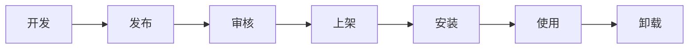
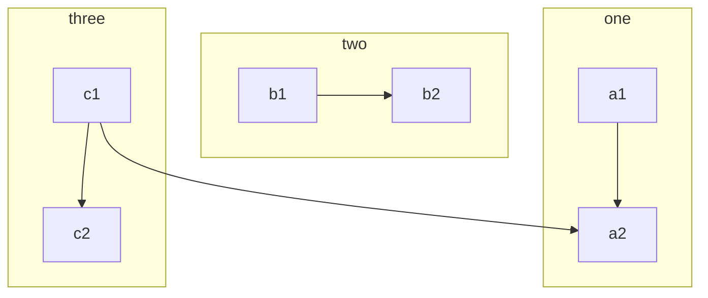
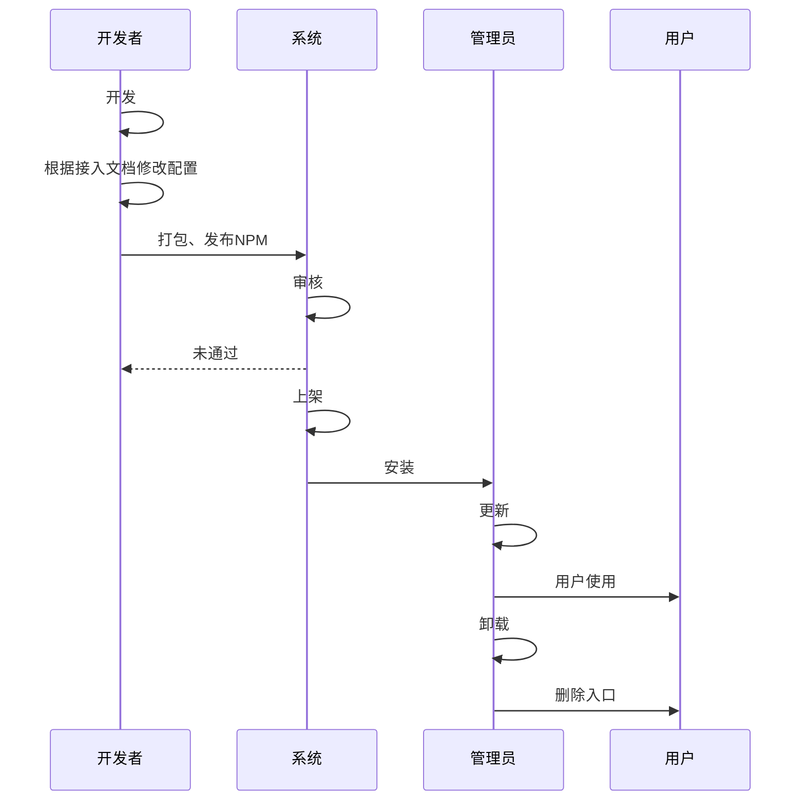
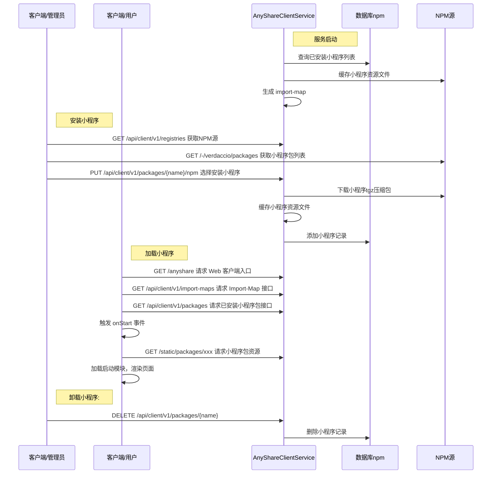
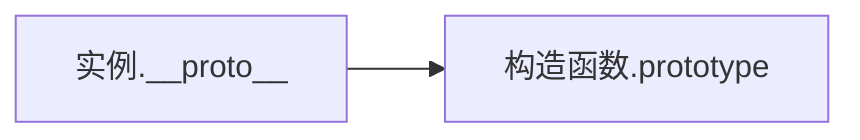

# experiment
代码实验和技术验证Mermaid Mermaid 

```mermaid
graph LR
开发-->发布;
发布-->审核;
审核-->上架;
上架-->安装;
安装-->使用;
使用-->卸载
```

```mermaid
graph TB
    c1-->a2
    subgraph one
    a1-->a2
    end
    subgraph two
    b1-->b2
    end
    subgraph three
    c1-->c2
    end
```

```mermaid
sequenceDiagram
　　　participant per as 开发者 
　　　participant system as 系统 
　　　participant admin as 管理员 
　　　participant user as 用户 
     per ->> per:开发
     per ->> per:根据接入文档修改配置
     per ->> system:打包、发布NPM
     system ->> system:审核
     system -->> per:未通过
     system ->> system:上架
     system ->> admin:安装
     admin ->> admin:更新
     admin ->> user:用户使用
     admin ->> admin:卸载
     admin ->> user:删除入口

```

```mermaid
sequenceDiagram
participant admin as 客户端/管理员
participant user as 客户端/用户
participant asc as AnyShareClientService
participant db as 数据库npm
participant npm as NPM源

Note right of asc: 服务启动
asc ->> db: 查询已安装小程序列表
asc ->> npm: 缓存小程序资源文件
asc ->> asc: 生成 import-map

Note right of admin: 安装小程序
admin ->> asc: GET /api/client/v1/registries 获取NPM源
admin ->> npm: GET /-/verdaccio/packages 获取小程序包列表
admin ->> asc: PUT /api/client/v1/packages/{name}/npm 选择安装小程序
asc ->> npm: 下载小程序tgz压缩包
asc ->> asc: 缓存小程序资源文件
asc ->> db: 添加小程序记录

Note right of user: 加载小程序
user ->> asc: GET /anyshare 请求 Web 客户端入口
user ->> asc: GET /api/client/v1/import-maps 请求 Import-Map 接口
user ->> asc: GET /api/client/v1/packages 请求已安装小程序包接口
user ->> user: 触发 onStart 事件
user ->> asc: GET /static/packages/xxx 请求小程序包资源
user ->> user: 加载启动模块，渲染页面

Note right of admin: 卸载小程序:
admin ->> asc: DELETE /api/client/v1/packages/{name}
asc ->> db: 删除小程序记录

```

```mermaid
graph LR
实例.__proto__ --> 构造函数.prototype 
```